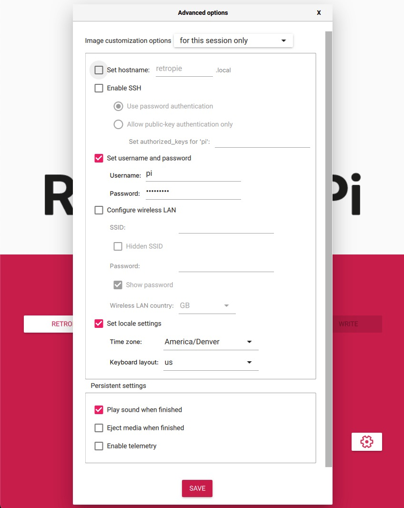
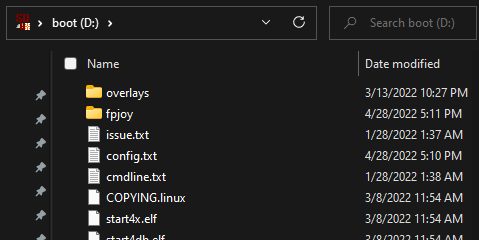

## To install with RetroPie on a new SD card
Download the latest Freeplay Joystick binary package from https://github.com/TheFlav/Freeplay_joystick_i2c/releases

Start "Raspberry Pi Imager" (download from https://www.raspberrypi.com/software/)

In "Raspberry Pi Imager"

- Select "CHOOSE OS"
	- **RECOMMENDED** (using a RetroPie image that you download elsewhere)
		- Select "Use custom" at the bottom of the list.
		- Select the RetroPie SD image file (recomended to download from https://retropie.org.uk/download/)
	- OPTIONAL (using the built-in RetroPie from Raspberry Pi Imager)
		- Under "Emulation and game OS" select RetroPie and choose the one suitable for your Pi
		- If the option you select does not give you the "GEAR icon" to change settings after selecting your SD card, then you may need a different selection or to download the image and "Use custom"
- Select your SD card
- Click the GEAR icon to select settings
	- **IMPORTANT**
		- Check the "Set locale settings" box and choose your Time Zone and Keyboard Layout
		- Check "Set username and password" and use "pi" as the username (without quotes) and the password you prefer.  ("raspberry" is the default password for RetroPie)
		- Uncheck "Eject media when finished"
	- RECOMMENDED/OPTIONAL
		- Check "Set hostname" and make a hostname that you prefer (if you don't want the default of "retropie")
		- Check the "Enable SSH" box and choose "Use password authentication" (unless you prefer to do some key auth)
	- Click "SAVE" at the bottom
	

- Click the "WRITE" button
- When it's done writing, you will want to open the "boot" drive on your computer which is the /boot partition of the newly created SD card.  If you don't see this drive, make sure that Raspberry Pi Imager is done writing.  If it's done writing, you may need to eject the SD card and re-insert it to get the "boot" drive to show up on your machine.
	- In this "boot" drive you will edit 3 files and add some files.
		- Open the cmdline.txt file with a text editor.  
			- If you see the following text in the file, REMOVE it without editing any other text, save the file, and exit.
				```
				console=serial0,115200
				```
			- If you do not see that text (it's typically the first thing in the file), just exit the text editor without saving.
				- Note:  It seems that this problematic text occurs in the "Raspberry Pi 1/Zero" RetroPie SD image but is not present in the "Raspberry Pi 2/3/Zero 2 W" SD image.
		- Open the config.txt file with a text editor and copy/paste the "[Freeplay Additions](#freeplay-additions)" (below) to the end of the file
			- If you are using a plastic shell intended for a GBA, then it's recommended to delete the # from the overscan lines that you just pasted in.  [Note that there are also overscan lines that were already in the file.]  This will allow you to use a GBA glass/plastic lens with a smaller viewable area then the full LCD.  You can tweak these lines to your liking.
		- Save the changes and close the config.txt file.
		- Copy the the fpjoy_binary_package.zip file (downloaded from https://github.com/TheFlav/Freeplay_joystick_i2c/releases) into the boot drive.
		- Unzip the fpjoy_binary_package.zip file
			- Mac:  double-click on the fpjoy_binary_package.zip file to automatically unzip the file
			- Windows:  double-click on the fpjoy_binary_package.zip file to open it and then drag the "fpjoy" folder from the newly opened window to the 'boot' drive. 
		- This should create a directory named "fpjoy" in the root of the 'boot' drive.
			- If you do not have this directory, the Freeplay portion install will fail.
			- If you have a directory named something like "fpjoy_binary_package_2022-04-26-15-03-53," the Freeplay portion install will fail.
			- 
		- Once you are SURE that you have the directory named "fpjoy" in the root of the 'boot' drive, then it is recommended to delete the fpjoy_binary_package.zip to save space.
			- You can also do this after you have tested the SD card in the Freeplay Zero.  
			- In fact, once the full installation is complete, and you are satisfied with how the Freeplay Zero is running, you may also delete the "fpjoy" directory from the 'boot' drive.
				- Note that your Windows/Mac operating system may not actually delete these files from the SD until you empty them from your trash.
		- Open the firstrun.sh file with a text editor.  This "firstrun.sh" file should be in the same directory as the "config.txt" file you previously edited.
			- In firstrun.sh, near the end of the file, you should find a line that says something like 
				```
				rm -f /boot/firstrun.sh
				```
			- Add a new line **BEFORE** this line that says.
				```
				/boot/fpjoy/fpjoy_firstrun.sh
				```
				- You should now have
				```
				/boot/fpjoy/fpjoy_firstrun.sh
				rm -f /boot/firstrun.sh
				```
			- Save the edited firstrun.sh file and close it.
	- Eject the boot drive (SD card).
	- Pop the SD card into your Freeplay.
	- Boot it up!
		- On the first boot it will expand the partition to use the entire SD card.
			- It will automatically shut itself down when it's done.
		- On the second boot it will do some initial setup stuff (like the config choices you made in Raspberry Pi Imager)
			- It will automatically shut itself down when it's done.
		- On the third boot, you should see RetroPie and then get a Joystick setup screen where you can detect and define analog parameters if you chose to add analog to your system.  If not, you can use the DPAD down to go to the SKIP option.
	- Cleanup
		- After your system is working, you may want to delete the fpjoy_binary_package.zip and fpjoy from the "boot" drive.

<a name="freeplay-additions"></a>
```
##### Freeplay Additions #####

framebuffer_width=640
framebuffer_height=480

[EDID=N/A-]
###dtoverlay=dpi18
gpio=0-9,12-17,20-25=a2
enable_dpi_lcd=1
display_default_lcd=1
extra_transpose_buffer=2
dpi_group=2
dpi_mode=87
dpi_output_format=0x6f006
dpi_timings=640 0 20 10 10 480 0 10 5 5 0 0 0 60 0 60000000 1
#overscan_left=32
#overscan_right=32
#overscan_top=15
#overscan_bottom=84

[edid=*]
gpio=0-9,12-17,20-25=ip
enable_dpi_lcd=0
display_default_lcd=0

[ALL]

dtoverlay=audremap,swap_lr=off,pins_18_19
dtoverlay=gpio-poweroff,gpiopin=26,active_low
dtoverlay=gpio-shutdown,gpio_pin=27,active_low=0,gpio_pull=off,debounce=4000

#set up /dev/i2c-0
#dtparam=i2c0_baudrate=10000 #low speed mode
#dtparam=i2c0_baudrate=100000 #standard mode
#dtparam=i2c0_baudrate=400000 #fast mode 
dtparam=i2c0_baudrate=1000000 #works with Freeplay i2c Joystick
#dtparam=i2c0_baudrate=3400000 #high speed mode (NOT RECOMMENDED)
[pi0]
dtoverlay=i2c0,pins_28_29
[pi0w]
dtoverlay=i2c0,pins_28_29
[pi02]
dtoverlay=i2c0,pins_44_45
[all]

#dtparam=watchdog=on


gpio=10=np
#dtoverlay=disable-wifi
#dtoverlay=disable-bt

dtparam=act_led_trigger=none
dtparam=act_led_activelow=off

dtparam=pwr_led_trigger=none
dtparam=pwr_led_activelow=off

audio_pwm_mode=2
##### END Freeplay Additions #####
```
	


## To install in an existing system
SSH into the system.  Download the latest binary package from https://github.com/TheFlav/Freeplay_joystick_i2c/releases.  Unzip it and run ./fpjoy/install_binary_package.sh to install this Freeplay i2c Joystick binary package

Open the config.txt file and copy/paste the "[Freeplay Additions](#freeplay-additions)" (above) to the end of the file:

- NOTE:  Since you are adding this to an existing system, you may have non-standard items in your config.txt  This may require some manual intervention to sort out any conflicts.
- If you are using a plastic shell intended for a GBA, then it's recommended to delete the # from the overscan lines that you just pasted in.  [Note that there are also overscan lines that were already in the file.]  This will allow you to use a GBA glass/plastic lens with a smaller viewable area then the full LCD.  You can tweak these lines to your liking.
- Save the changes and close the config.txt file.
